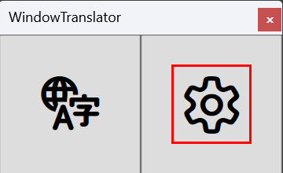
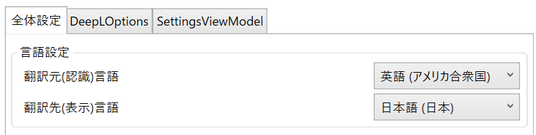
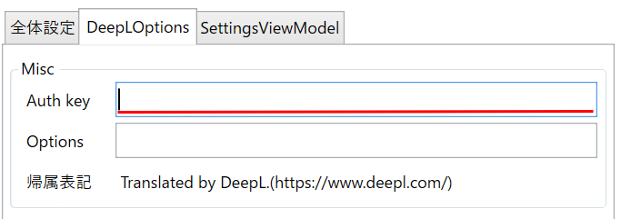
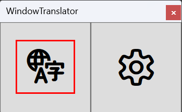

# WindowTranslator

WindowTranslatorは、Windowsのアプリケーションのウィンドウを翻訳するためのツールです。

# 使い方

## 事前準備

### 言語設定

翻訳元・翻訳先となる言語をWindowsの言語設定に追加してください。   
[Windowsの言語追加の方法](https://support.microsoft.com/ja-jp/windows/windows-%E7%94%A8%E3%81%AE%E8%A8%80%E8%AA%9E%E3%83%91%E3%83%83%E3%82%AF-a5094319-a92d-18de-5b53-1cfc697cfca8)   

[Windowsの言語設定を開く](ms-settings:regionlanguage?activationSource=SMC-Article-14236)

### DeepL APIキーの取得

[DeepLのサイト](https://www.deepl.com/ja/pro-api)からユーザー登録を行い、APIキーを取得してください。  
(手元では無料プランのAPIキーにて動作確認を行っていますが、有料プランのAPIキーでも動作すると思います)

## 起動

### 初回設定

1. `WindowTranslator.exe`を起動し、設定画面を開きます。  
  
2. 「全体設定」タブの「言語設定」から翻訳元・翻訳先の言語を選択します。  
  
3. 「DeepLOptions」タブのAPI Key: DeepLのAPIキーを入力します。
  
4. 設定が完了したら「OK」ボタンを押下して設定画面を閉じます。

### 翻訳の開始

1. `WindowTranslator.exe`を起動し、翻訳ボタンを押下します。  
  
2. 翻訳元のウィンドウを選択します。
3. 翻訳結果がオーバーレイで表示されます。  
  

## その他の設定

### 翻訳結果を別ウィンドウに表示する

### 特定のアプリケーションのウィンドウを常に翻訳する