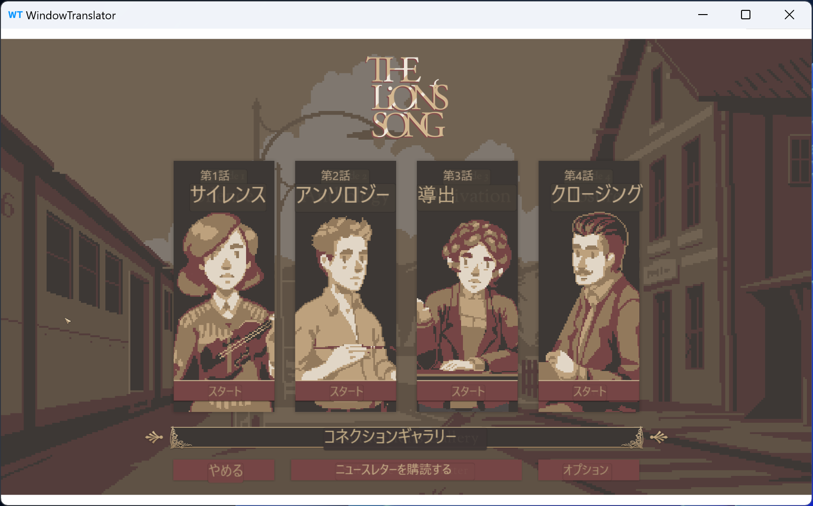
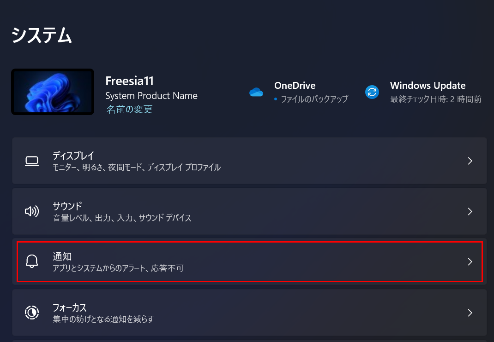

＃ WindowTranslator

WindowTranslator是一個用於翻譯Windows應用程序窗口的工具。

## 下載

從 [GitHub的發布頁面](https://github.com/Freeesia/WindowTranslator/releases/latest)下載zip文件，然後解壓到任意文件夾。

* `WindowTranslator-(版本).zip`可以在已安裝.NET的環境中運行。
* `WindowTranslator-full-(版本).zip`可在未安裝.NET的環境中運行。

## 使用方法

### 預備工作

#### 語言設置

請在Windows的語言設置中添加要作為翻譯來源和翻譯目標的語言。   
[為Windows添加語言的方法](https://support.microsoft.com/zh-tw/windows/windows-%E8%AA%9E%E8%A8%80%E5%A5%97%E4%BB%B6-a5094319-a92d-18de-5b53-1cfc697cfca8)

#### 獲取DeepL API密鑰

請訪問 [DeepL的網站](https://www.deepl.com/zh/pro-api) 註冊用戶，並獲取API密鑰。  
(我們使用免費計劃的API密鑰進行了測試，但認為付費計劃的API密鑰也可以使用)

### 啟動

#### 首次設置

1. 啟動`WindowTranslator.exe`，打開設置界面。   
  
2. 在“全局設置”標籤頁的“語言設置”中選擇翻譯來源和翻譯目標語言。   
  
3. 在“DeepLOptions”標籤頁輸入DeepL的API密鑰。   
  
4. 完成設置後，點擊“確定”按鈕關閉設置界面。

#### 開始翻譯

1. 啟動`WindowTranslator.exe`，點擊翻譯按鈕。   
  
2. 選擇要翻譯的應用程序窗口，然後點擊“確定”按鈕。   
  
3. 翻譯結果將以覆蓋層的形式顯示。   
  

### 其他設置

#### 將翻譯結果顯示在單獨的窗口中

您可以將翻譯結果顯示在單獨的窗口中。  
在設置界面的“全局設置”標籤頁中，將“翻譯結果顯示模式”選擇為“捕獲窗口”，然後點擊“確定”按鈕關閉設置界面。  

選擇要翻譯的應用程序後，翻譯結果將顯示在單獨的窗口中。  

#### 始終翻譯特定應用程序的窗口

您可以設置在特定應用程序啟動時，WindowTranslator自動檢測並開始翻譯。

1. 啟動`WindowTranslator.exe`，打開設置界面。   
  
2. 在“SettingsViewModel”標籤頁中，點擊“Register to startup command”的“執行”按鈕，以便在登錄時自動啟動。   
  
3. 在“全局設置”標籤頁的“自動翻譯目標”中輸入要翻譯的應用程序的進程名稱。   
  
  * 選中“在選擇翻譯目標進程後，當該進程啟動時自動進行翻譯”，以自動將其註冊為翻譯目標。
4. 完成設置後，點擊“確定”按鈕關閉設置界面。
5. 之後，當目標進程啟動時，將顯示開始翻譯的通知。   
  

##### 如果通知未顯示

如果通知未顯示，則可能是“忽略此問題”功能已啟用。  
請按照以下方法啟用通知：

1. 打開Windows的“設定”，然後打開“系統”中的“通知”設定。  
 
2. 選擇“自動忽略”，取消選中“在全屏模式下使用應用程序時”選項。   
  
3. 點擊“設置優先通知”，然後點擊“添加應用程序”。   
 
 
4. 選擇“WindowTranslator”。   
  
