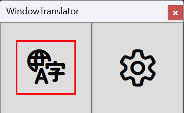
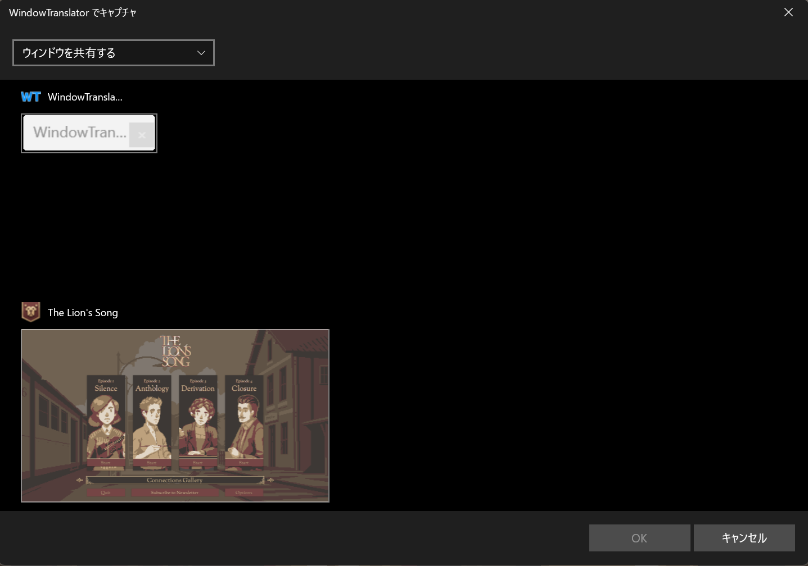
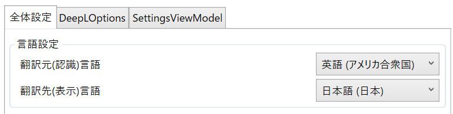

#  WindowTranslator

WindowTranslator je nástroj pro překlad oken aplikací v systému Windows.

[JA](README.md) | [EN](./README.en.md) | [DE](./README.de.md) | [KR](./README.kr.md) | [ZH-CN](./README.zh-cn.md) | [ZH-TW](./README.zh-tw.md) | [VI](./README.vi.md) | [HI](./README.hi.md) | [MS](./README.ms.md) | [ID](./README.id.md) | [PT-BR](./README.pt-BR.md) | [FR](./README.fr.md) | [ES](./README.es.md) | [AR](./README.ar.md) | [TR](./README.tr.md) | [TH](./README.th.md) | [RU](./README.ru.md) | [FIL](./README.fil.md) | [PL](./README.pl.md) | [FA](./README.fa.md) | [CS](./README.cs.md)

## Obsah
- [ WindowTranslator](#-windowtranslator)
  - [Obsah](#obsah)
  - [Stažení](#stažení)
    - [Verze Microsoft Store ](#verze-microsoft-store-)
    - [Instalační verze](#instalační-verze)
    - [Přenosná verze](#přenosná-verze)
  - [Jak používat](#jak-používat)
    - [Bergamot ](#bergamot-)
  - [Další funkce](#další-funkce)

## Stažení
### Verze Microsoft Store 

Nainstalujte z [Microsoft Store](https://apps.microsoft.com/detail/9pjd2fdzqxm3?referrer=appbadge&mode=direct).
Funguje i v prostředích, kde není nainstalováno .NET.

### Instalační verze

Stáhněte `WindowTranslator-(verze).msi` ze [stránky vydání GitHub](https://github.com/Freeesia/WindowTranslator/releases/latest) a spusťte jej pro instalaci.  
Výukové video pro instalaci je zde⬇️  

### Přenosná verze

Stáhněte soubor zip ze [stránky vydání GitHub](https://github.com/Freeesia/WindowTranslator/releases/latest) a rozbalte jej do libovolné složky.  
- `WindowTranslator-(verze).zip` : Vyžaduje prostředí .NET  
- `WindowTranslator-full-(verze).zip` : Nezávislé na .NET

## Jak používat

### Bergamot 

1. Spusťte `WindowTranslator.exe` a klikněte na tlačítko překladu.  
   
2. Vyberte okno aplikace, kterou chcete přeložit, a klikněte na tlačítko „OK".  
   
3. Na kartě „Obecná nastavení" vyberte zdrojový a cílový jazyk v části „Nastavení jazyka".  
   
4. Po dokončení nastavení klikněte na tlačítko „OK" pro zavření obrazovky nastavení.  
   > Může být vyžadována instalace funkce OCR.
   > Postupujte podle pokynů k instalaci.
5. Po chvíli se výsledky překladu zobrazí jako překryv.  
   

> [!NOTE]
> V aplikaci WindowTranslator jsou k dispozici různé překladové moduly.  
> Google Translate má nízký limit množství textu, který lze přeložit. Pokud jej používáte často, zvažte použití jiných modulů.  
> Seznam dostupných překladových modulů najdete ve videích níže nebo v [Dokumentaci](https://wt.studiofreesia.com/TranslateModule.en).
> 
> |                |                                                           Výukové video                                                            | Výhody                    | Nevýhody                        |
> | :------------: | :-----------------------------------------------------------------------------------------------------------------------------------: | :---------------------------- | :----------------------------------- |
> |   Bergamot     | | Zcela zdarma Bez omezení překladu Rychlý překlad | Nižší přesnost překladu Vyžaduje více než 1 GB volné paměti |
> |   Google Translate   |   | Zcela zdarma | Nízký limit překladu Nižší přesnost překladu |
> |     DeepL      |      | Velká bezplatná kvóta Rychlý překlad | |
> |     Gemini     |  | Vysoká přesnost překladu | Vyžaduje malý poplatek |
> |    ChatGPT     | TBD | Vysoká přesnost překladu | Vyžaduje malý poplatek |
> | Lokální LLM | TBD | Samotná služba je zdarma | Vyžaduje výkonný počítač |

## Další funkce

Kromě překladových modulů má WindowTranslator různé funkce.  
Pokud se chcete dozvědět více, podívejte se na [Wiki](https://github.com/Freeesia/WindowTranslator/wiki).

---
[Zásady ochrany osobních údajů](PrivacyPolicy.cs.md)

Tento dokument byl přeložen z japonštiny pomocí strojového překladu.
