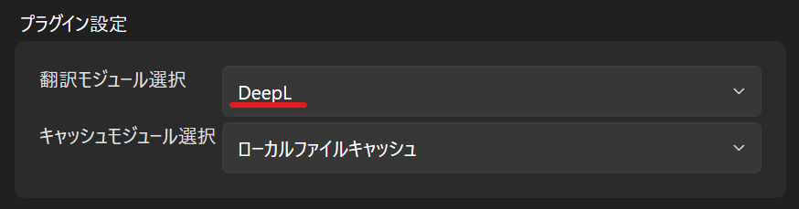

#  WindowTranslator

WindowTranslator ist ein Tool zum Übersetzen von Windows-Anwendungsfenstern.

[JA](README.md) | [EN](./README.en.md) | [DE](./README.de.md) | [KR](./README.kr.md) | [ZH-CN](./README.zh-cn.md) | [ZH-TW](./README.zh-tw.md)

## Download

### Installationsversion 
Laden Sie die MSI-Datei von der [GitHub-Releases-Seite](https://github.com/Freeesia/WindowTranslator/releases/latest) herunter und führen Sie sie aus, um WindowTranslator zu installieren.

### Portable Version
Laden Sie die ZIP-Datei von der [GitHub-Releases-Seite](https://github.com/Freeesia/WindowTranslator/releases/latest) herunter und entpacken Sie sie in einen beliebigen Ordner.

## Anwendung

### Video-Version
|                   | DeepL-Version | Google AI-Version |
| ----------------- | ------------- | ----------------- |
| Videolink         |  |  |
| Vorteile          | Schnelle Übersetzung, großzügiges kostenloses Kontingent | Höhere Übersetzungsgenauigkeit |
| Nachteile         | Geringere Übersetzungsgenauigkeit | Erfordert geringe Zahlung, langsamere Übersetzung |

### Voraussetzungen

#### DeepL API-Schlüssel erhalten
Registrieren Sie sich auf der [DeepL-Website](https://www.deepl.com/pro-api) und erhalten Sie Ihren API-Schlüssel.  
(Funktioniert mit kostenlosen und kostenpflichtigen Tarifen)

> DeepL wird als Übersetzungsmaschine verwendet.  
> Für die Nutzung generativer KI-Übersetzung konfigurieren Sie das [LLM Plugin](https://github.com/Freeesia/WindowTranslator/wiki/LLMPlugin).

## Start

#### Ersteinrichtung

1. Starten Sie `WindowTranslator.exe` und öffnen Sie den Einstellungsbildschirm.  
   
2. Wählen Sie im Tab "Allgemeine Einstellungen" unter "Spracheinstellungen" die Quell- und Zielsprache aus.  
   
3. Wählen Sie im Tab "Plugin-Einstellungen" unter "Übersetzungsmodul" den Punkt "DeepL".  
   
4. Geben Sie im Tab "DeepLOptions" Ihren DeepL API-Schlüssel ein.  
   
5. Klicken Sie auf "OK", um den Einstellungsbildschirm zu schließen.

> Beim Schließen müssen Sie möglicherweise OCR-Funktionalitäten installieren, um die Quellsprache zu erkennen. Bitte folgen Sie den Anweisungen.

#### Übersetzungsstart

1. Starten Sie `WindowTranslator.exe` und klicken Sie auf die Schaltfläche "Übersetzen".  
   
2. Wählen Sie das Fenster der Anwendung, die übersetzt werden soll, und klicken Sie auf "OK".  
   
3. Das Übersetzungsergebnis erscheint als Overlay.  
   

## Weitere Funktionen

Weitere Informationen finden Sie im [Wiki](https://github.com/Freeesia/WindowTranslator/wiki).

---  
Datenschutzerklärung: [Datenschutzerklärung](PrivacyPolicy.de.md)

> ※ Dieses Dokument wurde maschinell übersetzt.