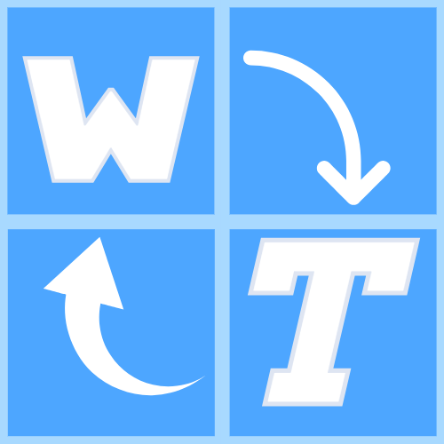

#  WindowTranslator

WindowTranslator یک ابزار ترجمه پنجره برنامه‌ها در ویندوز است.

[JA](README.md) | [EN](./README.en.md) | [DE](./README.de.md) | [KR](./README.kr.md) | [ZH-CN](./README.zh-cn.md) | [ZH-TW](./README.zh-tw.md) | [VI](./README.vi.md) | [HI](./README.hi.md) | [MS](./README.ms.md) | [ID](./README.id.md) | [PT-BR](./README.pt-BR.md) | [FR](./README.fr.md) | [ES](./README.es.md) | [AR](./README.ar.md) | [TR](./README.tr.md) | [TH](./README.th.md) | [RU](./README.ru.md) | [FIL](./README.fil.md) | [PL](./README.pl.md) | [FA](./README.fa.md)

## فهرست مطالب
- [ WindowTranslator](#-windowtranslator)
  - [فهرست مطالب](#فهرست-مطالب)
  - [دانلود](#دانلود)
    - [نسخه Microsoft Store ](#نسخه-microsoft-store-)
    - [نسخه نصب‌کننده](#نسخه-نصبکننده)
    - [نسخه قابل حمل](#نسخه-قابل-حمل)
  - [نحوه استفاده](#نحوه-استفاده)
    - [Bergamot ](#bergamot-)
  - [ویژگی‌های دیگر](#ویژگیهای-دیگر)

## دانلود
### نسخه Microsoft Store 

از [Microsoft Store](https://apps.microsoft.com/detail/9pjd2fdzqxm3?referrer=appbadge&mode=direct) نصب کنید.
حتی در محیط‌هایی که .NET نصب نشده است کار می‌کند.

### نسخه نصب‌کننده

`WindowTranslator-(نسخه).msi` را از [صفحه انتشار GitHub](https://github.com/Freeesia/WindowTranslator/releases/latest) دانلود کرده و برای نصب اجرا کنید.  
ویدیوی آموزشی نصب اینجا⬇️  

### نسخه قابل حمل

فایل zip را از [صفحه انتشار GitHub](https://github.com/Freeesia/WindowTranslator/releases/latest) دانلود کرده و در هر پوشه‌ای باز کنید.  
- `WindowTranslator-(نسخه).zip` : نیاز به محیط .NET دارد  
- `WindowTranslator-full-(نسخه).zip` : مستقل از .NET

## نحوه استفاده

### Bergamot 

1. `WindowTranslator.exe` را اجرا کنید و روی دکمه ترجمه کلیک کنید.  
   
2. پنجره برنامه‌ای که می‌خواهید ترجمه شود را انتخاب کنید و روی «OK» کلیک کنید.  
   
3. از برگه «تنظیمات عمومی»، زبان‌های مبدأ و مقصد را در «تنظیمات زبان» انتخاب کنید.  
   
4. پس از تکمیل تنظیمات، روی «OK» کلیک کنید تا صفحه تنظیمات بسته شود.  
   > ممکن است نیاز به نصب قابلیت OCR باشد.
   > لطفاً دستورالعمل‌ها را برای نصب دنبال کنید.
5. پس از لحظه‌ای، نتایج ترجمه به عنوان پوشش نمایش داده می‌شود.  
   

> [!NOTE]
> چندین ماژول ترجمه در WindowTranslator موجود است.  
> ترجمه Google محدودیت پایینی بر مقدار متن قابل ترجمه دارد. اگر به طور مکرر استفاده می‌کنید، استفاده از ماژول‌های دیگر را در نظر بگیرید.  
> می‌توانید لیست ماژول‌های ترجمه موجود را در ویدیوهای زیر یا در [مستندات](https://wt.studiofreesia.com/TranslateModule.fa) بررسی کنید.
> 
> |                |                                                           ویدیوی استفاده                                                            | مزایا                    | معایب                        |
> | :------------: | :-----------------------------------------------------------------------------------------------------------------------------------: | :---------------------------- | :----------------------------------- |
> |   Bergamot     | | کاملاً رایگان بدون محدودیت ترجمه ترجمه سریع | دقت ترجمه کمتر نیاز به بیش از 1 گیگابایت حافظه آزاد |
> |   ترجمه Google   |   | کاملاً رایگان | محدودیت ترجمه پایین دقت ترجمه کمتر |
> |     DeepL      |      | طبقه رایگان بزرگ ترجمه سریع | |
> |     Gemini     |  | دقت ترجمه بالا | هزینه اندک لازم است |
> |    ChatGPT     | TBD | دقت ترجمه بالا | هزینه اندک لازم است |
> | LLM محلی | TBD | خدمت خود رایگان است | نیاز به رایانه با مشخصات بالا |

## ویژگی‌های دیگر

علاوه بر ماژول‌های ترجمه، WindowTranslator دارای ویژگی‌های متنوعی است.  
اگر می‌خواهید بیشتر بدانید، لطفاً به [Wiki](https://github.com/Freeesia/WindowTranslator/wiki) مراجعه کنید.

---
[سیاست حریم خصوصی](PrivacyPolicy.md)

این مستند از ژاپنی با استفاده از ترجمه ماشینی ترجمه شده است.
