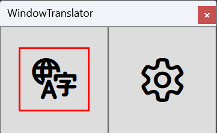

#  WindowTranslator

WindowTranslator는 Windows 애플리케이션 창을 번역하기 위한 도구입니다.

[JA](README.md) | [EN](./README.en.md) | [DE](./README.de.md) | [KR](./README.kr.md) | [ZH-CN](./README.zh-cn.md) | [ZH-TW](./README.zh-tw.md) | [VI](./README.vi.md)

## 목차
- [ WindowTranslator](#-windowtranslator)
  - [목차](#목차)
  - [다운로드](#다운로드)
    - [설치 버전 ](#설치-버전-)
    - [포터블 버전](#포터블-버전)
  - [사용법](#사용법)
    - [Bergamot ](#bergamot-)
  - [기타 기능](#기타-기능)

## 다운로드
### 설치 버전 

[GitHub 릴리스 페이지](https://github.com/Freeesia/WindowTranslator/releases/latest)에서 `WindowTranslator-(버전).msi`를 다운로드하여 실행하고 설치합니다.  
설치 안내 비디오⬇️  

### 포터블 버전

[GitHub 릴리스 페이지](https://github.com/Freeesia/WindowTranslator/releases/latest)에서 zip 파일을 다운로드하여 원하는 폴더에 압축을 풉니다.  
- `WindowTranslator-(버전).zip` : .NET 환경 필요  
- `WindowTranslator-full-(버전).zip` : .NET 독립

## 사용법

### Bergamot 

1. `WindowTranslator.exe`를 실행하고 번역 버튼을 클릭합니다.  
   
2. 번역하려는 애플리케이션 창을 선택하고 "확인" 버튼을 클릭합니다.  
   
3. "일반 설정" 탭의 "언어 설정"에서 원본 언어와 대상 언어를 선택합니다.  
   
4. 설정을 완료한 후 "확인" 버튼을 클릭하여 설정 화면을 닫습니다.  
   > OCR 기능 설치가 필요할 수 있습니다.
   > 지시에 따라 설치하십시오.
5. 잠시 후 번역 결과가 오버레이로 표시됩니다.  
   

> [!NOTE]
> WindowTranslator에서는 다양한 번역 모듈이 사용 가능합니다.  
> Google 번역은 번역할 수 있는 텍스트 양이 적으며, 자주 사용하는 경우 다른 모듈 사용을 고려해보세요.  
> 사용 가능한 번역 모듈 목록은 아래 동영상이나 [위키](https://github.com/Freeesia/WindowTranslator/wiki#翻訳)에서 확인할 수 있습니다.
> 
> |                |                                                          사용법 동영상                                                           | 장점                    | 단점                        |
> | :------------: | :-----------------------------------------------------------------------------------------------------------------------------------: | :---------------------------- | :----------------------------------- |
> |   Bergamot     | | 완전 무료 번역 제한 없음 번역 속도 빠름 | 번역 정확도가 낮음 1GB 이상의 여유 메모리 필요 |
> |   Google 번역   |   | 완전 무료 | 낮은 번역 제한 번역 정확도가 낮음 |
> |     DeepL      |      | 무료 사용량 많음 번역 속도 빠름 | |
> |     Gemini     |  | 번역 정확도 높음 | 소액 결제 필요 |
> | ChatGPT (클라우드) | TBD | 번역 정확도 높음 | 소액 결제 필요 |
> | ChatGPT (로컬) | TBD | 서비스 자체는 무료 | 고사양 PC 필요 |

## 기타 기능

번역 모듈 외에도 WindowTranslator에는 다양한 기능이 있습니다.  
더 많은 정보를 원하시면 [위키](https://github.com/Freeesia/WindowTranslator/wiki)를 확인하세요.

---
[개인정보 처리방침](PrivacyPolicy.md)

이 문서는 일본어에서 기계 번역을 사용하여 번역되었습니다.