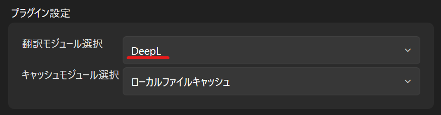

#  WindowTranslator

WindowTranslator는 윈도우 애플리케이션의 창을 번역하는 도구입니다.

[JA](README.md) | [EN](./README.en.md) | [DE](./README.de.md) | [KR](./README.kr.md) | [ZH-CN](./README.zh-cn.md) | [ZH-TW](./README.zh-tw.md)

## 다운로드

### 설치판 
[GitHub 릴리즈 페이지](https://github.com/Freeesia/WindowTranslator/releases/latest)에서 MSI 파일을 다운로드 받아 실행하여 WindowTranslator를 설치합니다.

### 포터블 판
[GitHub 릴리즈 페이지](https://github.com/Freeesia/WindowTranslator/releases/latest)에서 ZIP 파일을 다운로드 받아 원하는 폴더에 압축을 풉니다.

## 사용 방법

### 영상 버전
|               | DeepL 버전 | Google AI 버전 |
| ------------- | ----------- | -------------- |
| 영상 링크     |  |  |
| 장점          | 빠른 번역, 넉넉한 무료 할당량 | 높은 번역 정확도 |
| 단점          | 다소 낮은 번역 정확도 | 소액 결제가 필요하며, 번역 속도가 느림 |

### 사전 준비

#### DeepL API 키 받기
[DeepL 사이트](https://www.deepl.com/ja/pro-api)에서 사용자 등록 후 API 키를 발급받습니다.  
(무료 플랜 및 유료 플랜 모두 작동합니다)

> DeepL이 번역 엔진으로 사용됩니다.  
> 생성형 AI 번역을 사용하려면 [LLM 플러그인](https://github.com/Freeesia/WindowTranslator/wiki/LLMPlugin)을 설정하십시오.

## 실행

#### 최초 설정

1. `WindowTranslator.exe`를 실행하여 설정 화면을 엽니다.  
   
2. "전체 설정" 탭의 "언어 설정"에서 원본 언어와 대상 언어를 선택합니다.  
   
3. "플러그인 설정" 탭에서 "번역 모듈"로 "DeepL"을 선택합니다.  
   
4. "DeepLOptions" 탭에 DeepL API 키를 입력합니다.  
   
5. 설정 완료 후 "OK" 버튼을 눌러 설정 화면을 닫습니다.

> 설정 창을 닫을 때 원본 언어 인식을 위해 OCR 기능 설치가 필요할 수 있습니다. 안내에 따라 설치하세요.

#### 번역 시작

1. `WindowTranslator.exe`를 실행하고 "번역" 버튼을 누릅니다.  
   
2. 번역할 앱의 창을 선택하고 "OK" 버튼을 누릅니다.  
   
3. 번역 결과가 오버레이로 표시됩니다.  
   

## 기타 기능

자세한 사항은 [Wiki](https://github.com/Freeesia/WindowTranslator/wiki)를 참조하세요.

---
개인정보 처리방침: [개인정보 처리방침](PrivacyPolicy.md)

> ※ 이 문서는 기계 번역되었습니다.