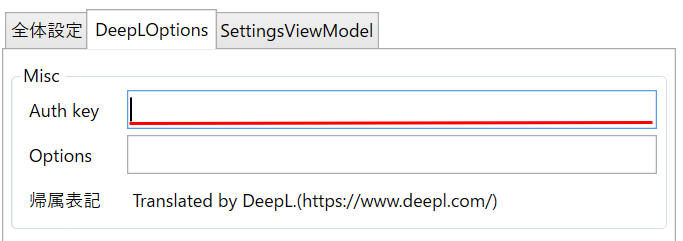

# WindowTranslator

WindowTranslatorは、Windowsのアプリケーションのウィンドウを翻訳するためのツールです。

[JA](README.md) | [EN](./README.en.md) | [DE](./README.de.md) | [KR](./README.kr.md) | [ZH-CN](./README.zh-cn.md) | [ZH-TW](./README.zh-tw.md)

## ダウンロード
### インストール版

[GitHubのリリースページ](https://github.com/Freeesia/WindowTranslator/releases/latest)からmsiをダウンロードおよび実行してインストールを行います。

### ポータブル版

[GitHubのリリースページ](https://github.com/Freeesia/WindowTranslator/releases/latest)からzipをダウンロードして任意のフォルダに展開します

* `WindowTranslator-(バージョン).zip`は.NETがインストールされている環境で動作します
* `WindowTranslator-full-(バージョン).zip`は.NETがインストールされていない環境でも動作します

## 使い方

### 事前準備

#### 言語設定

翻訳元・翻訳先となる言語をWindowsの言語設定に追加してください。   
[Windowsの言語追加の方法](https://support.microsoft.com/ja-jp/windows/windows-%E7%94%A8%E3%81%AE%E8%A8%80%E8%AA%9E%E3%83%91%E3%83%83%E3%82%AF-a5094319-a92d-18de-5b53-1cfc697cfca8)   

#### DeepL APIキーの取得

[DeepLのサイト](https://www.deepl.com/ja/pro-api)からユーザー登録を行い、APIキーを取得してください。  
(手元では無料プランのAPIキーにて動作確認を行っていますが、有料プランのAPIキーでも動作すると思います)

### 起動

#### 初回設定

1. `WindowTranslator.exe`を起動し、設定画面を開きます。  
  
2. 「全体設定」タブの「言語設定」から翻訳元・翻訳先の言語を選択します。  
  
3. 「DeepLOptions」タブのAPI Key: DeepLのAPIキーを入力します。
  
4. 設定が完了したら「OK」ボタンを押下して設定画面を閉じます。

#### 翻訳の開始

1. `WindowTranslator.exe`を起動し、翻訳ボタンを押下します。  
  
2. 翻訳したいアプリのウィンドウを選択し、「OK」ボタンを押下します。
  
3. 翻訳結果がオーバーレイで表示されます。  
  

### その他の設定

#### 翻訳結果を別ウィンドウに表示する

翻訳結果を別ウィンドウに表示することができます。  
設定画面の「全体設定」タブの「翻訳結果表示モード」で「キャプチャーウィンドウ」を選択し、「OK」ボタンを押下して設定画面を閉じます。

翻訳したいアプリを選択すると、翻訳結果が別ウィンドウに表示されます。

#### 特定のアプリケーションのウィンドウを常に翻訳する

特定のアプリケーションが起動したときに、WindowTranslatorがアプリケーションを検知して翻訳を開始するように設定できます。

1. `WindowTranslator.exe`を起動し、設定画面を開きます。  
  
2. 「SettingsViewModel」タブから「Register to startup command」の「実行」ボタンを押下し、ログオン時に自動起動するように設定します。
  
3. 「全体設定」タブの「自動翻訳対象」に翻訳したいアプリケーションのプロセス名を入力します。  
  
  * 「一度翻訳対象に選択したプロセスが起動したときに自動的に翻訳する」にチェックを入れることで自動的に翻訳対象に登録されます。
4. 設定が完了したら「OK」ボタンを押下して設定画面を閉じます。
5. 以降、対象のプロセスが起動したときに、翻訳を開始するかの通知が表示されます。  
  

##### 通知が表示されない場合

通知が表示されない場合、「応答不可」が有効になっている可能性があります。  
以下の方法で通知を有効化してください。

1. Windowsの「設定」から「システム」の「通知」設定を開きます。  
 
2. 「応答不可を自動的にオンにする」を選択し、「全画面モードでアプリを使用するとき」にチェックを外します。
  
3. 「優先通知を設定する」の「アプリの追加」を押下します。  
 
 
4. 「WindowTranslator」を選択します。
  
