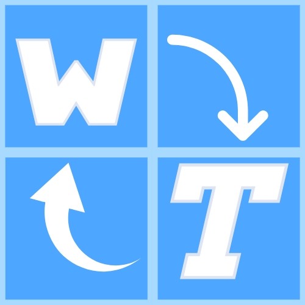
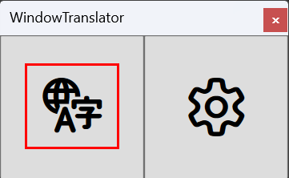
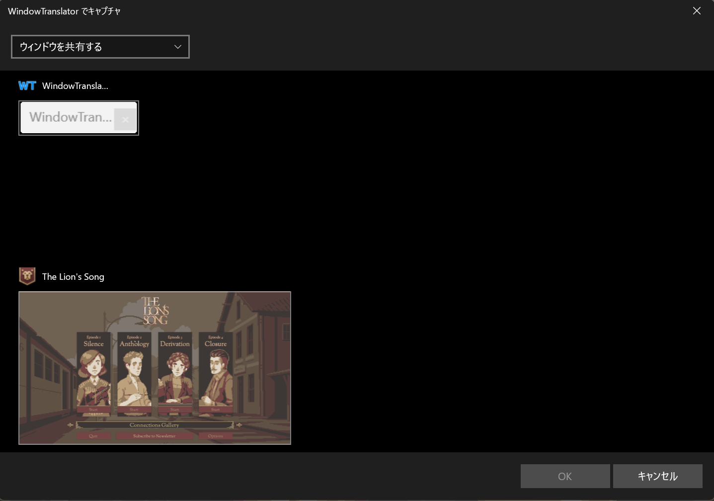
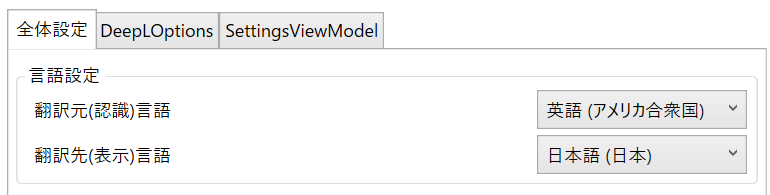

#  WindowTranslator

WindowTranslator é uma ferramenta para traduzir as janelas de aplicativos do Windows.

[JA](README.md) | [EN](./README.en.md) | [DE](./README.de.md) | [KR](./README.kr.md) | [ZH-CN](./README.zh-cn.md) | [ZH-TW](./README.zh-tw.md) | [VI](./README.vi.md) | [HI](./README.hi.md) | [MS](./README.ms.md) | [ID](./README.id.md) | [PT-BR](./README.pt-BR.md)

## Índice
- [ WindowTranslator](#-windowtranslator)
  - [Índice](#Índice)
  - [Download](#Download)
    - [Versão Microsoft Store ](#microsoft-store-)
    - [Versão para instalação](#Versão para instalação)
    - [Versão portátil](#Versão portátil)
  - [Como usar](#Como usar)
    - [Bergamot ](#bergamot-)
  - [Outras funções](#Outras funções)

## Download
### Versão Microsoft Store 

[Microsoft Store](https://apps.microsoft.com/detail/9pjd2fdzqxm3?referrer=appbadge&mode=direct)para instalar.
Funciona mesmo em ambientes onde o .NET não está instalado.

### Versão para instalação

[página de releases do GitHub](https://github.com/Freeesia/WindowTranslator/releases/latest)de `WindowTranslator-(versão).msi`e execute para instalar.  
Vídeo tutorial de instalação aqui⬇️  

### Versão portátil

[página de releases do GitHub](https://github.com/Freeesia/WindowTranslator/releases/latest)de arquivo zip e extraia para qualquer pasta.  
- `WindowTranslator-(versão).zip` : Requer ambiente .NET  
- `WindowTranslator-full-(versão).zip` : Independente do .NET

## Como usar

### Bergamot 

1. `WindowTranslator.exe`e clique no botão de tradução.  
   
2. Selecione a janela do aplicativo que deseja traduzir e clique no botão "OK".  
   
3. Na aba "Configurações Gerais", em "Configuração de Idioma", selecione o idioma de origem e destino.  
   
4. Após concluir as configurações, clique no botão "OK" para fechar a tela de configurações.  
   > A instalação da função OCR pode ser necessária.
   > Siga as instruções para instalar.
5. Após alguns instantes, o resultado da tradução será exibido como sobreposição.  
   

> [!NOTE]
> Vários módulos de tradução estão disponíveis no WindowTranslator.  
> O Google Tradutor tem um limite baixo de texto traduzível. Se você usa com frequência, considere usar outros módulos.  
> A lista de módulos de tradução disponíveis pode ser vista no vídeo abaixo ou na [documentação](https://wt.studiofreesia.com/TranslateModule).
> 
> |                |                                                              Vídeo de uso                                                               | Vantagens                    | Desvantagens                        |
> | :------------: | :-----------------------------------------------------------------------------------------------------------------------------------: | :-------------------------- | :-------------------------------- |
> |   Bergamot     | | Totalmente gratuito Sem limite de tradução Tradução rápida | Menor precisão de tradução Requer mais de 1GB de memória livre |
> |   Google Tradutor   |   | Totalmente gratuito | Limite de tradução baixo Menor precisão de tradução |
> |     DeepL      |      | Grande cota gratuita Tradução rápida | |
> |     Gemini     |  | Alta precisão de tradução | Requer pequeno pagamento |
> |    ChatGPT     | TBD | Alta precisão de tradução | Requer pequeno pagamento |
> |  LLM Local   | TBD | O serviço em si é gratuito | Requer PC de alto desempenho |

## Outras funções

Além dos módulos de tradução, o WindowTranslator possui várias outras funções.  
Para aqueles que desejam usar mais recursos, consulte a[Wiki](https://github.com/Freeesia/WindowTranslator/wiki) .

---
[Política de Privacidade](PrivacyPolicy.md)
