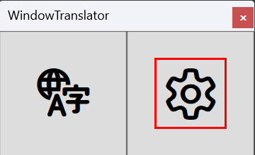
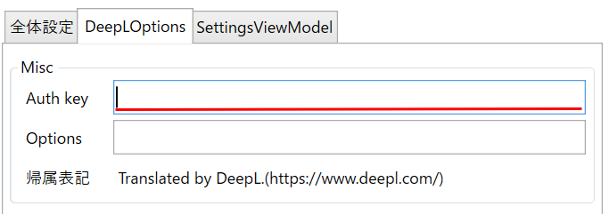
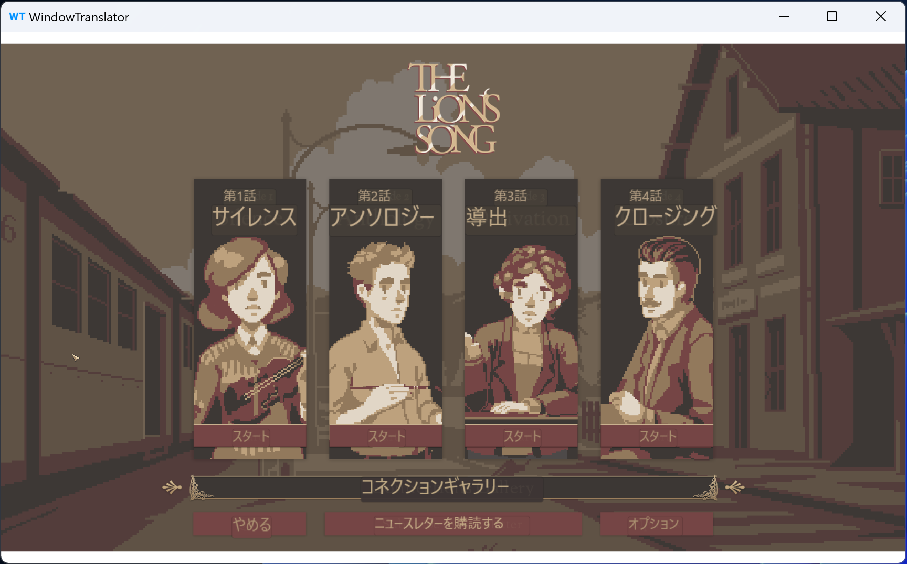
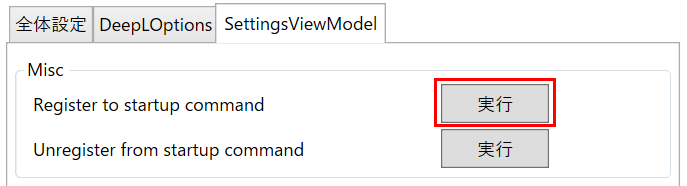
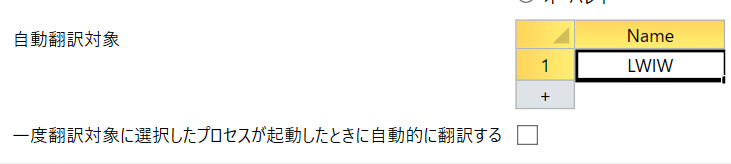
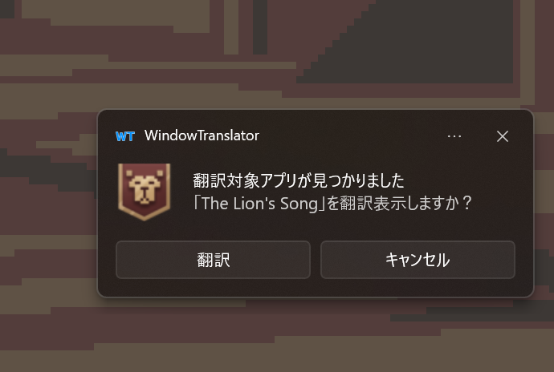
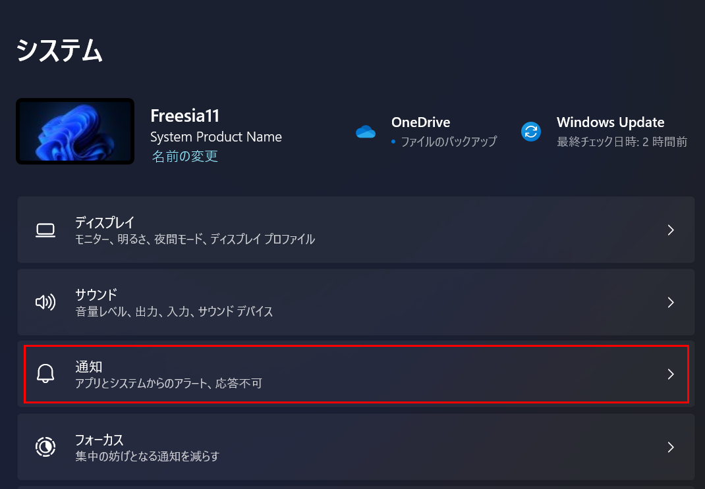
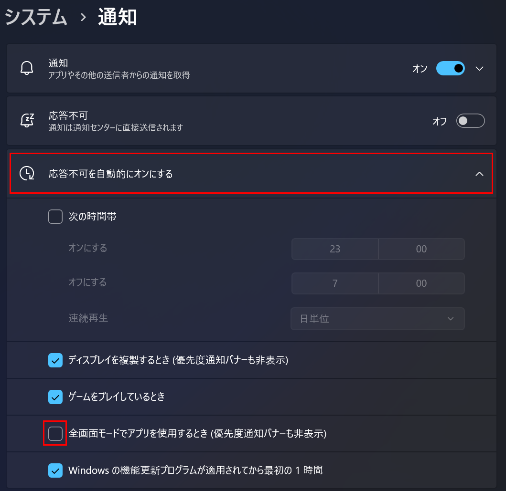
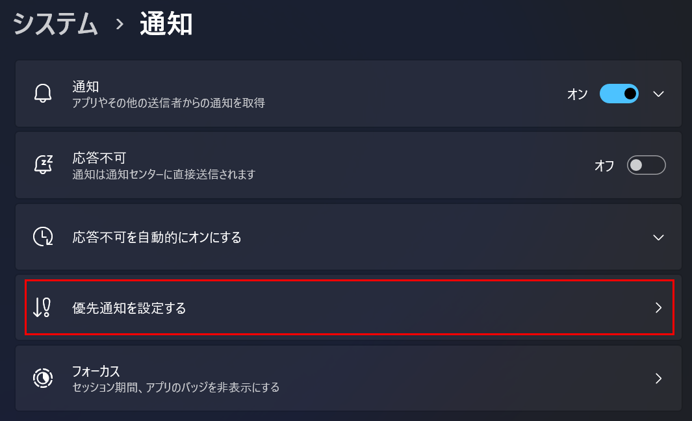
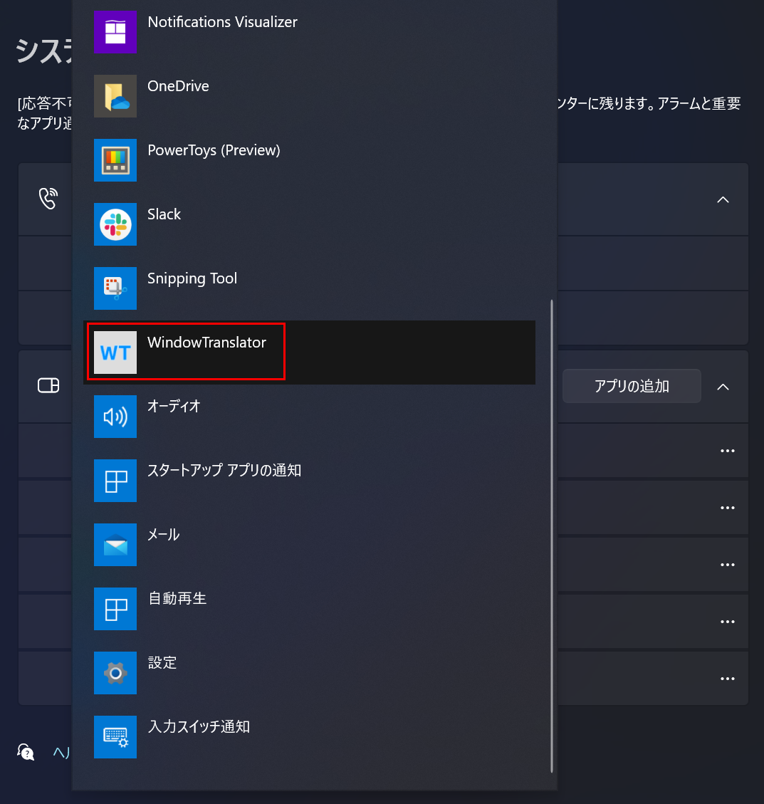

＃ WindowTranslator

WindowTranslator是一个用于翻译Windows应用程序窗口的工具。

[JA](README.md) | [EN](./README.en.md) | [DE](./README.de.md) | [KO](./README.ko.md) | [ZH-CN](./README.zh-cn.md) | [ZH-TW](./README.zh-tw.md)

## 下载

从 [GitHub的发布页面](https://github.com/Freeesia/WindowTranslator/releases/latest)下载zip文件，然后解压到任意文件夹。

* `WindowTranslator-(版本).zip`可以在已安装.NET的环境中运行。
* `WindowTranslator-full-(版本).zip`可在未安装.NET的环境中运行。

## 使用方法

### 准备工作

#### 语言设置

请在Windows的语言设置中添加要作为翻译来源和翻译目标的语言。
[为Windows添加语言的方法](https://support.microsoft.com/zh-cn/windows/windows-%E7%94%A8%E3%81%AE%E8%A8%80%E8%AA%9E%E3%83%91%E3%83%83%E3%82%AF-a5094319-a92d-18de-5b53-1cfc697cfca8)

#### 获取DeepL API密钥

请访问 [DeepL的网站](https://www.deepl.com/zh/pro-api) 注册用户，并获取API密钥。  
(我们使用免费计划的API密钥进行了测试，但认为付费计划的API密钥也可以使用)

### 启动

#### 首次设置

1. 启动`WindowTranslator.exe`，打开设置界面。   
  
2. 在“全局设置”标签页的“语言设置”中选择翻译来源和翻译目标语言。   
  
3. 在“DeepLOptions”标签页输入DeepL的API密钥。   
  
4. 完成设置后，点击“确定”按钮关闭设置界面。

#### 开始翻译

1. 启动`WindowTranslator.exe`，点击翻译按钮。   
  
2. 选择要翻译的应用程序窗口，然后点击“确定”按钮。   
  
3. 翻译结果将以覆盖层的形式显示。   
  

### 其他设置

#### 将翻译结果显示在单独的窗口中

您可以将翻译结果显示在单独的窗口中。  
在设置界面的“全局设置”标签页中，将“翻译结果显示模式”选择为“捕获窗口”，然后点击“确定”按钮关闭设置界面。  

选择要翻译的应用程序后，翻译结果将显示在单独的窗口中。  

#### 始终翻译特定应用程序的窗口

您可以设置在特定应用程序启动时，WindowTranslator自动检测并开始翻译。

1. 启动`WindowTranslator.exe`，打开设置界面。   
  
2. 在“SettingsViewModel”标签页中，点击“Register to startup command”下的“执行”按钮，以便在登录时自动启动。   
  
3. 在“全局设置”标签页的“自动翻译目标”中输入要翻译的应用程序的进程名称。   
  
  * 选中“在选择翻译目标进程后，当该进程启动时自动进行翻译”以自动将其注册为翻译目标。
4. 完成设置后，点击“确定”按钮关闭设置界面。
5. 之后，当目标进程启动时，将显示开始翻译的通知。   
  

##### 如果通知未显示

如果通知未显示，则可能是“忽略此问题”功能已启用。  
请按照以下方法启用通知：

1. 从Windows的“设置”中打开“系统”的“通知”设置。
 
2. 选择“自动开启忽略此问题”，然后取消选中“在全屏模式下使用应用程序时”。
  
3. 点击“设置优先通知”的“添加应用程序”。
 
 
4. 选择“WindowTranslator”。
  

> Translated with ChatGPT