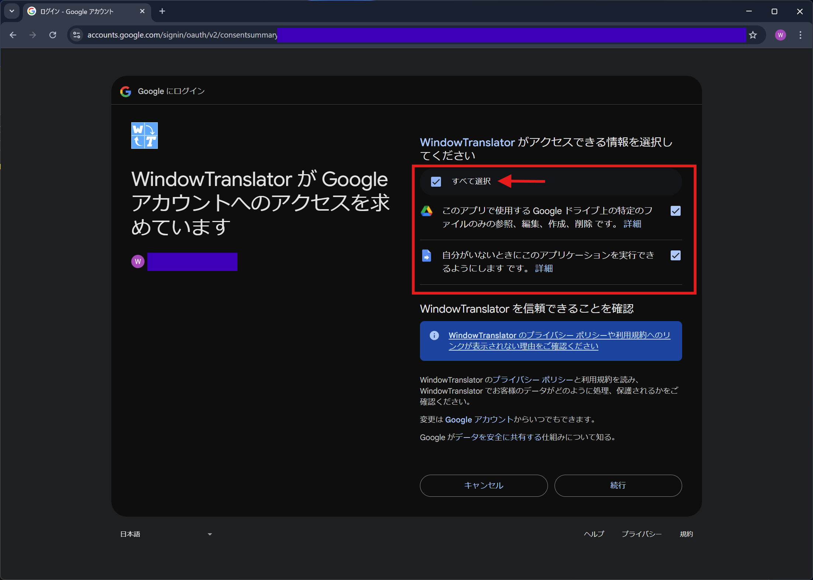

#  WindowTranslator

WindowTranslator 是一个用于翻译 Windows 应用程序窗口内容的工具。

[JA](README.md) | [EN](README.en.md) | [DE](README.de.md) | [KR](README.kr.md) | [ZH-CN](README.zh-cn.md) | [ZH-TW](README.zh-tw.md)

## 目录
- [ WindowTranslator](#-windowtranslator)
  - [目录](#目录)
  - [下载](#下载)
    - [安装版 ](#安装版-)
    - [便携版](#便携版)
  - [使用方法](#使用方法)
    - [Google 翻译 ](#google-翻译-)
  - [其他功能](#其他功能)

## 下载
### 安装版 
请从 [GitHub Releases 页面](https://github.com/Freeesia/WindowTranslator/releases/latest) 下载 `WindowTranslator-(版本).msi` 并运行进行安装。  
安装视频如下：  

### 便携版
请从 [GitHub Releases 页面](https://github.com/Freeesia/WindowTranslator/releases/latest) 下载压缩文件并解压到任意文件夹。  
- `WindowTranslator-(版本).zip`：需要 .NET 环境。  
- `WindowTranslator-full-(版本).zip`：无需 .NET 环境。

## 使用方法

### Google 翻译 

1. 启动 `WindowTranslator.exe` 并点击翻译按钮。  
   
2. 选择要翻译的应用程序窗口后点击“OK”。  
   
3. 在“通用设置”选项卡的“语言设置”中选择源语言和目标语言。  
   
4. 确认设置后，点击“OK”关闭设置对话框。  
   > 如果需要OCR功能，请按提示安装。
5. 浏览器将启动并显示Google登录页面。  
   
6. 登录后，选择“全部选择”以授予权限，然后点击“继续”。  
   
7. 稍后翻译结果将以浮层形式显示。  
   

> [!NOTE]
> WindowTranslator 支持多种翻译模块，这里展示的是默认的 Google 翻译方法。  
> 由于 Google 翻译限制翻译文本量，若使用频率较高请考虑使用其他翻译模块。  
> 更多可用的翻译模块请参见下方视频或 [Wiki](https://github.com/Freeesia/WindowTranslator/wiki#translation)。
> 
> |             |                                    使用视频                                    | 优势                        | 劣势                               |
> | ----------- | :---------------------------------------------------------------------------: | --------------------------- | ---------------------------------- |
> | Google 翻译 |                                    TBD                                      | 设置简单 完全免费         | 翻译上限低 准确度较低             |
> | DeepL       |  | 免费额度较高 翻译速度快     | 准确度较低                         |
> | GoogleAI    |  | 高准确度                    | 需要少量付费                        |
> | LLM (云端)   |                                    TBD                                      | 高准确度                    | 需要少量付费                        |
> | LLM (本地)   |                                    TBD                                      | 免费服务                    | 需要高配置电脑                      |

## 其他功能

请参阅 [Wiki](https://github.com/Freeesia/WindowTranslator/wiki) 了解更多功能。

---  
隐私政策: [隐私政策](PrivacyPolicy.zh-cn.md)

> ※ 本文档为机器翻译。