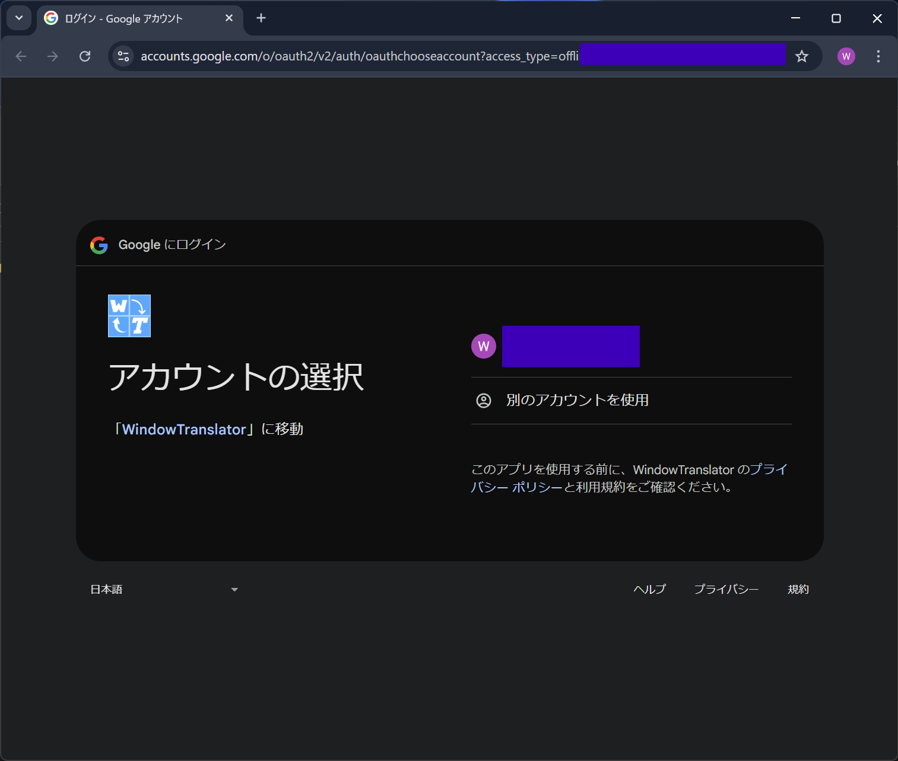
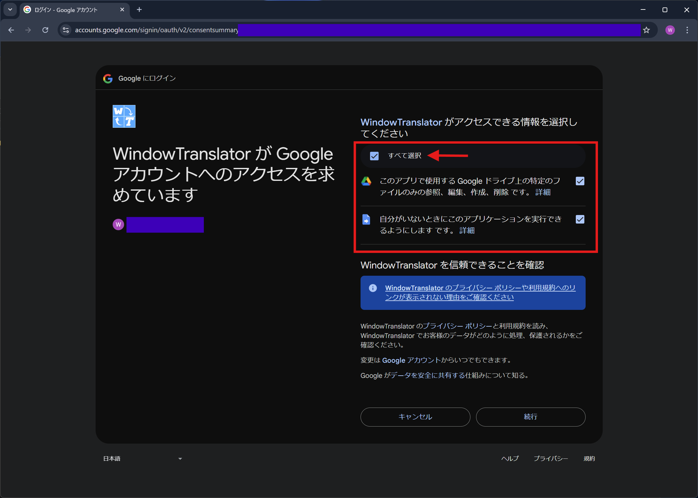

#  WindowTranslator

WindowTranslator 是一個用於翻譯 Windows 應用程式視窗內容的工具。

[JA](README.md) | [EN](README.en.md) | [DE](README.de.md) | [KR](README.kr.md) | [ZH-CN](README.zh-cn.md) | [ZH-TW](README.zh-tw.md)

## 目錄
- [ WindowTranslator](#-windowtranslator)
  - [目錄](#目錄)
  - [下載](#下載)
    - [安裝版 ](#安裝版-)
    - [便攜版](#便攜版)
  - [使用方法](#使用方法)
    - [Google 翻譯 ](#google-翻譯-)
  - [其他功能](#其他功能)

## 下載
### 安裝版 
請從 [GitHub Releases 頁面](https://github.com/Freeesia/WindowTranslator/releases/latest) 下載 `WindowTranslator-(版本).msi` 並執行進行安裝。  
安裝影片如下：  

### 便攜版
請從 [GitHub Releases 頁面](https://github.com/Freeesia/WindowTranslator/releases/latest) 下載壓縮檔並解壓至任意資料夾。  
- `WindowTranslator-(版本).zip`：需要 .NET 環境。  
- `WindowTranslator-full-(版本).zip`：不依賴 .NET。

## 使用方法

### Google 翻譯 

1. 啟動 `WindowTranslator.exe` 並點選翻譯按鈕。  
   
2. 選擇要翻譯的應用程式視窗，然後點選「OK」。  
   
3. 在「通用設定」頁籤中的「語言設定」選擇原始語言和目標語言。  
   
4. 設定完成後，點選「OK」關閉設定對話框。  
   > 若需要 OCR 功能，請依照指示安裝。
5. 瀏覽器將啟動並顯示 Google 登入畫面。  
   
6. 登入後，選擇「全部選取」以授權，然後點擊「繼續」。  
   
7. 稍後翻譯結果將以浮層方式顯示。  
   

> [!NOTE]
> WindowTranslator 支援多種翻譯模組，此處展示預設的 Google 翻譯使用法。  
> 由於 Google 翻譯限定翻譯文字量，若使用頻率較高請考慮其他模組。  
> 更多可用翻譯模組請參考下方影片或 [Wiki](https://github.com/Freeesia/WindowTranslator/wiki#translation)。
> 
> |              |                                  使用影片                                  | 優點                         | 缺點                                |
> | ------------ | :-----------------------------------------------------------------------: | ---------------------------- | ----------------------------------- |
> | Google 翻譯  |                                  TBD                                      | 設定簡單 完全免費         | 翻譯上限低 準確度較低              |
> | DeepL        |  | 免費額度高 翻譯迅速         | 準確度較低                         |
> | GoogleAI     |  | 準確度高                    | 需要少量付費                         |
> | LLM (雲端)    |                                  TBD                                      | 準確度高                    | 需要少量付費                         |
> | LLM (本機)    |                                  TBD                                      | 免費服務                    | 需要高規格電腦                       |

## 其他功能

請參閱 [Wiki](https://github.com/Freeesia/WindowTranslator/wiki) 了解更多功能。

---  
隱私政策: [隱私政策](PrivacyPolicy.zh-tw.md)

> ※ 本文件為機器翻譯。