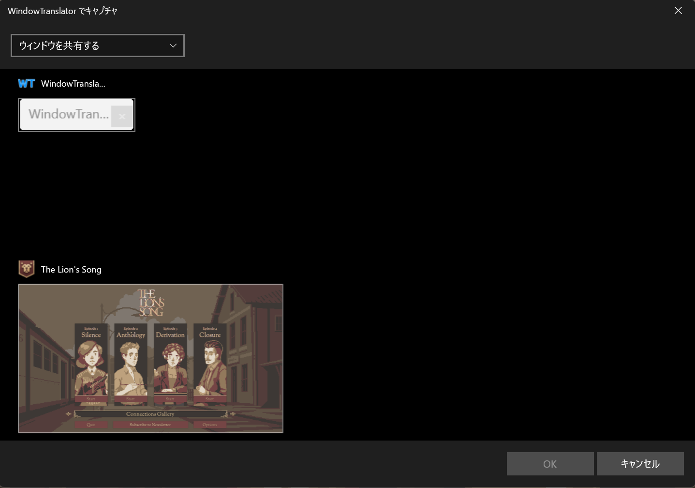

#  WindowTranslator

WindowTranslator是一款用於翻譯Windows應用程式視窗的工具。

[JA](README.md) | [EN](./README.en.md) | [DE](./README.de.md) | [KR](./README.kr.md) | [ZH-CN](./README.zh-cn.md) | [ZH-TW](./README.zh-tw.md) | [VI](./README.vi.md) | [HI](./README.hi.md) | [MS](./README.ms.md) | [ID](./README.id.md)

## 目錄
- [ WindowTranslator](#-windowtranslator)
  - [目錄](#目錄)
  - [下載](#下載)
    - [Microsoft Store 版本 ](#microsoft-store-版本-)
    - [安裝版](#安裝版)
    - [可攜版](#可攜版)
  - [使用方法](#使用方法)
    - [Bergamot ](#bergamot-)
  - [其他功能](#其他功能)

## 下載
### Microsoft Store 版本 

從 [Microsoft Store](https://apps.microsoft.com/detail/9pjd2fdzqxm3?referrer=appbadge&mode=direct) 安裝。
即使在未安裝 .NET 的環境中也能正常運作。

### 安裝版

從[GitHub發布頁面](https://github.com/Freeesia/WindowTranslator/releases/latest)下載`WindowTranslator-(版本).msi`並運行安裝。  
安裝指南影片在這裡⬇️  

### 可攜版

從[GitHub發布頁面](https://github.com/Freeesia/WindowTranslator/releases/latest)下載zip檔案並解壓到任意資料夾。  
- `WindowTranslator-(版本).zip` : 需要.NET環境  
- `WindowTranslator-full-(版本).zip` : 不依賴.NET

## 使用方法

### Bergamot 

1. 啟動`WindowTranslator.exe`並點擊翻譯按鈕。  
   
2. 選擇要翻譯的應用程式視窗，然後點擊「確定」按鈕。  
   
3. 在「全體設定」選項卡中的「語言設定」中選擇翻譯來源語言和翻譯目標語言。  
   
4. 完成設定後，點擊「確定」按鈕關閉設定畫面。  
   > 可能需要安裝OCR功能。
   > 請按照指示進行安裝。
5. 稍後翻譯結果將以覆蓋層形式顯示。  
   

> [!NOTE]
> WindowTranslator提供各種翻譯模組。  
> Google翻譯可翻譯的文字量較少，如果您經常使用，請考慮使用其他模組。  
> 您可以在下面的影片或[文件](https://wt.studiofreesia.com/TranslateModule.zh-tw)中查看可用翻譯模組列表。
> 
> |                |                                                          使用方法影片                                                           | 優點                    | 缺點                        |
> | :------------: | :-----------------------------------------------------------------------------------------------------------------------------------: | :---------------------------- | :----------------------------------- |
> |   Bergamot     | | 完全免費 無翻譯限制 翻譯速度快 | 翻譯準確度較低 需要1GB以上空閒記憶體 |
> |   Google翻譯   |   | 完全免費 | 翻譯限制低 翻譯準確度較低 |
> |     DeepL      |      | 免費額度大 翻譯速度快 | |
> |     Gemini     |  | 翻譯準確度高 | 需要少量付費 |
> |    ChatGPT     | TBD | 翻譯準確度高 | 需要少量付費 |
> | 本地LLM | TBD | 服務本身免費 | 需要高配置PC |

## 其他功能

除了翻譯模組外，WindowTranslator還搭載了各種功能。  
如果想了解更多，請查看[Wiki](https://github.com/Freeesia/WindowTranslator/wiki)。

---
[隱私政策](PrivacyPolicy.md)

本文檔是使用機器翻譯從日語翻譯而來。