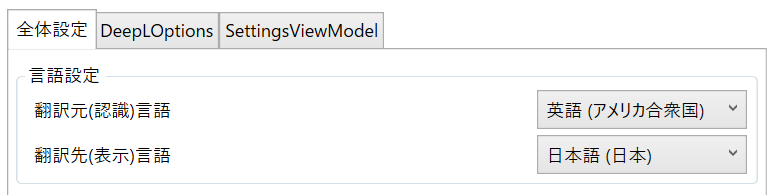

#  WindowTranslator

WindowTranslator是一個用於翻譯Windows應用程序窗口的工具。

[JA](README.md) | [EN](./README.en.md) | [DE](./README.de.md) | [KR](./README.kr.md) | [ZH-CN](./README.zh-cn.md) | [ZH-TW](./README.zh-tw.md)

## 下載

從 [GitHub的發布頁面](https://github.com/Freeesia/WindowTranslator/releases/latest)下載zip文件，然後解壓到任意文件夾。

* `WindowTranslator-(版本).zip`可以在已安裝.NET的環境中運行。
* `WindowTranslator-full-(版本).zip`可在未安裝.NET的環境中運行。

## 使用方法

### 預備工作

#### 獲取DeepL API密鑰

請訪問 [DeepL的網站](https://www.deepl.com/zh/pro-api) 註冊用戶，並獲取API密鑰。  
(我們使用免費計劃的API密鑰進行了測試，但認為付費計劃的API密鑰也可以使用)

### 啟動

#### 首次設置

1. 啟動`WindowTranslator.exe`，打開設置界面。   
  
2. 在“全局設置”標籤頁的“語言設置”中選擇翻譯來源和翻譯目標語言。   
  
3. 在“DeepLOptions”標籤頁輸入DeepL的API密鑰。   
  
4. 完成設置後，點擊“確定”按鈕關閉設置界面。

#### 開始翻譯

1. 啟動`WindowTranslator.exe`，點擊翻譯按鈕。   
  
2. 選擇要翻譯的應用程序窗口，然後點擊“確定”按鈕。   
  
3. 翻譯結果將以覆蓋層的形式顯示。   
  

## 它能做什麼？

WindowTranslator是一個用於翻譯Windows應用程序窗口的工具。它提供以下功能：

- 翻譯Windows應用程序窗口
- 支持多種語言
- 使用各種翻譯模塊

### 如何獲取和使用DeepL API密鑰

1. 請訪問 [DeepL的網站](https://www.deepl.com/pro-api) 註冊用戶，並獲取API密鑰。
2. 啟動`WindowTranslator.exe`，打開設置界面。
3. 在“DeepLOptions”標籤頁的“API Key”字段中輸入您的DeepL API密鑰。
4. 完成設置後，點擊“確定”按鈕關閉設置界面。

### 其他翻譯模塊

WindowTranslator還支持其他翻譯模塊。以下是它們的一些優點：

- Google翻譯：設置簡單且完全免費，但翻譯限制較低，翻譯準確性可能較低。
- DeepL：提供大量免費配額和快速翻譯，但翻譯準確性可能較低。
- GoogleAI：翻譯準確性高，但需要支付少量費用。
- LLM（雲端）：翻譯準確性高，但需要支付少量費用。
- LLM（本地）：服務本身免費，但需要高規格的PC。
